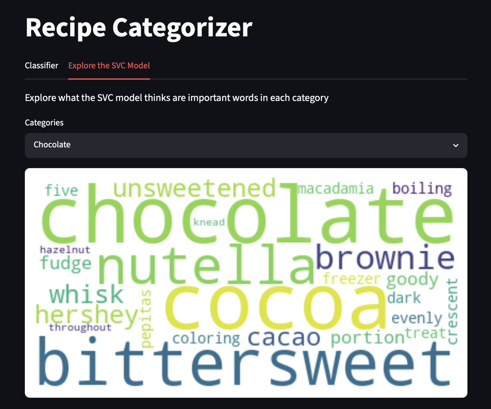

# Recipe Classification Project

This is a project to automatically assign tags to a recipe based on its title, ingredients, and instructions. I originally had this idea after downloading an app that saves recipes to your phone. This app features a scraper function, which grabs a recipe from a webpage and saves it locally. It also features categories that you can assign to each recipe to better organize a larger cooking library. However, these tags have to all be assigned manually, which is time consuming when adding recipes in bulk. A tool that suggests tags based on the recipe content could then save significant time. 

To make this tool, I decided to train a machine learning model to automatically assign tags to a recipe. The first step in this process was to obtain a dataset of recipes which already have labels assigned. I looked at several premade datasets, but they were either too small, didn't contain enough variety of tags, or had issues with how the recipes were structured. Ultimately, I decided to scrape recipes from America's Test Kitchen (ATK), a company with a history of producing high quality, well written recipes. In addition, each recipe already has several categories associated with it. From the website, I ultimately scraped over 12,000 recipes. In the "Categorizing_Recipes" jupyter notebook, I show the code I used to scrape the ATK website for recipes. However, due to changes in the website, the scraper is no longer functional. To recreate the database, one would need an updated scraper as well as a subscription to ATK.

The data is then cleaned, removing stopwords and lemmatizing with NLTK. From this cleaned dataset, I can then begin training the model. I opted to take two approaches. The first is to use a classical machine learning model alongside a TF-IDF vectorizer. The second is to use the DistilBERT tokenizer, and then fine tune the DistilBERT using the LoRA technique. The first approach has the advantage of being very fast to train, and a higher level of interpretability in the model. The second approach employs a more sophisticated model which has the potential to learn how words are used in different contexts. 

After training several different classical machine models, I found that the support vector classifier (SVC) had the highest level of performance. Other models (Naive Bayes, Logistic Regression, Random Forest) gave similar but slightly worse overall performance. To assess the performance, I compare the precision, recall, and F1 scores of each tag alongside micro and macro averages of these scores. The SVC model gave the highest of all three scores, both for micro and macro averages. 

The DistilBERT model gave similar performance to the SVC model, though the training takes significantly longer even when using the LoRA technique. More concretely, the DistilBERT model had a micro and macro F1 scores of .768 and .711, and the SVC model had micro and macro F1 scores of 0.771 and .730. At first glance, it might be somewhat surprising that the more sophisticated model gives similar results to the older, simpler model. There are several reasons for this that we discuss at the end of the "Categorizing_Recipes" jupyter notebook, and summarize here. 

The first reason is that the tags may be inconsistently applied. These tags on the ATK website are applied by a team of humans, where they may occasionally be inconsistencies in when a particular tag is applied. Regardless of the model, if tags are not applied in a consistent manner, then the model will not effectively learn when to apply a tag. The second reason is that some tags are severely imbalanced. Several categories appear less than 100 times, making it difficult for a model to learn when it should be applied. Lastly, these deep learning neural networks tend to benefit from larger datasets even more than the classical machine learning models. If the database were to increase in size, the DistilBERT model would most like ultimately overtake the SVC model. 

In addition to the aforementioned jupyter notebook, I've also included app.py, a Streamlit app designed to let a user explore the models I've trained. The first tab is a classifier that takes a recipe's title, ingredients, and instructions, and assigns categories to that recipe. The user can choose whether to use the SVC model or the DistilBERT model to classify the recipe, and compare the results. The second tab allows the user to explore how the SVC model assigns tags. For each tag, the top 25 words the SVC model associates with category are used to create a Word Cloud, where larger words are stronger indicators of the category. Below is a screenshot of the app in the second tab, showing the Word Cloud for the chocolate tag. All python packages needed to run the jupyter notebook and the streamlit app are included in the requirements.txt file. 

## Running the App
1. Clone the repository and install dependencies:
   pip install -r requirements.txt
2. Launch the Streamlit app:
   streamlit run app.py